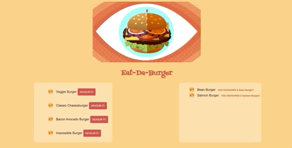

# burger
## A burger logger created with mySQL, node, express, and handlebars. 

### Description
This is a mini restaurant app that allows users to input the names of burgers they'd like to eat, then devour the burgers, and see a list of all of the burgers that they've devoured.

### Installation
To install, fork the repo and clone it to your machine. To run the application, you will need:
- Express
- Handlebars
- mySQL

- Run npm install in order to install all of the dependencies.

- When initializing your own database, update the config/connection to include your mySQL password, if any.

- Once the database schema is initialized, use node to start the server and start the app.

### Usage
Use the field at the bottom of the page to enter the name of a burger you would like to it. It will appear with a button that allows the user to click it and devour the burger. The devoured burgers will display at the right hand of the screen.

